  

<h1 align="center">ratacat</h1>

  Agent tools, memory systems, documentation pipelines, prediction-market research, MUD tooling, and small weird interfaces.

---

I build tools for AI-assisted development: better context, better coordination, richer memory, and sharper command surfaces for agents.

## Featured Public Work

| Project | What it does |
| --- | --- |
| [html-home](https://github.com/ratacat/html-home) | Gives repo-local HTML artifacts one localhost front door through manifests, a local index, and a read-only server. |
| [pro-cli](https://github.com/ratacat/pro-cli) | Gives agents a JSON-first CLI for ChatGPT Pro and Deep Research through a logged-in browser session. |
| [raindrop-cli](https://github.com/ratacat/raindrop-cli) | Exposes Raindrop bookmarks through a clean agent-friendly CLI. |
| [discive](https://github.com/ratacat/discive) | Experiments with disciplined discovery and command-line research flows. |
| [extra-eyes](https://github.com/ratacat/extra-eyes) | Runs parallel review passes so agents can catch misses in each other's work. |
| [liquid-mail](https://github.com/ratacat/liquid-mail) | Turns agent coordination logs into searchable project memory. |
| [knb](https://github.com/ratacat/knb) | Builds knowledge-base workflows for research, synthesis, and durable context. |
| [salt-ai](https://github.com/ratacat/salt-ai) | Explores small agent tools and experiments around AI-assisted work. |
| [annas-archive-ebooks](https://github.com/ratacat/annas-archive-ebooks) | Adds ebook search and download workflows for agent-assisted research. |
| [claude-skills](https://github.com/ratacat/claude-skills) | Collects reusable agent skills and tooling for building them from source material. |
| [ascii-love](https://github.com/ratacat/ascii-love) | Plays with terminal-native visual interfaces and ASCII display work. |

## Villagecraft

  

[Villagecraft](https://github.com/ratacat/villagecraft) was a community calendar and organizing platform for neighborhood-scale workshops, skillshares, and hands-on projects.

The work centered on ground-up organizing: helping people coordinate groups, share resources, find spaces, spread the word, and make local co-learning visible. The old FAQ framed it as tools for "hands-on learning activities at the neighborhood level" and a network for co-creation, creative projects, wellness workshops, and community-led making.

## Public Work Index

### Agent Infrastructure

| Thread | Repos |
| --- | --- |
| Agent context | [slurp-ai](https://github.com/ratacat/slurp-ai), [claude-skills](https://github.com/ratacat/claude-skills), [annas-archive-ebooks](https://github.com/ratacat/annas-archive-ebooks) |
| Agent command surfaces | [pro-cli](https://github.com/ratacat/pro-cli), [raindrop-cli](https://github.com/ratacat/raindrop-cli), [discive](https://github.com/ratacat/discive) |
| Agent coordination | [liquid-mail](https://github.com/ratacat/liquid-mail), [pair-programmer-ai](https://github.com/ratacat/pair-programmer-ai), [openclaw-hindsight](https://github.com/ratacat/openclaw-hindsight) |
| Agent experiments | [extra-eyes](https://github.com/ratacat/extra-eyes), [knb](https://github.com/ratacat/knb), [ai-isms](https://github.com/ratacat/ai-isms), [dianalokada-skill](https://github.com/ratacat/dianalokada-skill), [gloss](https://github.com/ratacat/gloss), [rivet](https://github.com/ratacat/rivet), [salt-ai](https://github.com/ratacat/salt-ai) |

### Interfaces And Displays

| Thread | Repos |
| --- | --- |
| Browser and visual context | [glimpsy](https://github.com/ratacat/glimpsy), [ascii-love](https://github.com/ratacat/ascii-love), [itoa](https://github.com/ratacat/itoa) |
| GitHub display experiments | [github-marquee](https://github.com/ratacat/github-marquee) |
| Text and social archives | [jeffrey-emanuels-tweets](https://github.com/ratacat/jeffrey-emanuels-tweets) |

### MUDs, Games, And Virtual Worlds

| Thread | Repos |
| --- | --- |
| Ranvier and MUD ecosystem | [mudcolors](https://github.com/ratacat/mudcolors), [mudcolors-tester](https://github.com/ratacat/mudcolors-tester), [ranvier-community](https://github.com/ratacat/ranvier-community), [ranvier-awesome](https://github.com/ratacat/ranvier-awesome), [ranvier-multi-arg-parser](https://github.com/ratacat/ranvier-multi-arg-parser), [area-respawn](https://github.com/ratacat/area-respawn) |
| Enceladus and game work | [enceladusgame](https://github.com/ratacat/enceladusgame), [enceladus-client](https://github.com/ratacat/enceladus-client), [evermore-color-staging](https://github.com/ratacat/evermore-color-staging) |
| Older web games and exercises | [catchphrase](https://github.com/ratacat/catchphrase), [ToEat.ly](https://github.com/ratacat/ToEat.ly), [bitly_clone](https://github.com/ratacat/bitly_clone), [burger_app](https://github.com/ratacat/burger_app), [json_blob_challenge](https://github.com/ratacat/json_blob_challenge) |

### Public Forks And Adaptations

| Thread | Repos |
| --- | --- |
| Agent and AI systems | [ypi](https://github.com/ratacat/ypi), [codex-orchestrator](https://github.com/ratacat/codex-orchestrator), [stealth-browser-mcp](https://github.com/ratacat/stealth-browser-mcp), [LlamaIndexTS](https://github.com/ratacat/LlamaIndexTS), [tokens](https://github.com/ratacat/tokens), [exa-cli](https://github.com/ratacat/exa-cli) |
| Prediction markets and crypto | [pmxt](https://github.com/ratacat/pmxt), [testnets](https://github.com/ratacat/testnets) |
| MUD/Ranvier ecosystem | [ranviermud](https://github.com/ratacat/ranviermud), [pinwheel](https://github.com/ratacat/pinwheel), [core](https://github.com/ratacat/core), [awesome-ranvier](https://github.com/ratacat/awesome-ranvier), [axolemma](https://github.com/ratacat/axolemma), [neuro](https://github.com/ratacat/neuro), [dome-client.js](https://github.com/ratacat/dome-client.js), [lobus](https://github.com/ratacat/lobus) |

## Private And Closed Work

Named without links:

| Area | Projects |
| --- | --- |
| Prediction-market research and trading systems | `pdb`, `pm`, `pm-weather`, `polymarket`, `trading`, `econ`, `pmknb`, `research` |
| Agent memory and knowledge systems | `dev-decision-traces`, `knowledge-scanner`, `ai-deas`, `magic-treehouse`, `tremors` |
| MUD automation and game agents | `mudbot`, `mudbot-btree`, `Our-Mortal-Haul`, `rune-age-sagas`, `eterna`, `ember` |
| Browser, media, and research tools | `clearfeed`, `clearfeed-extension`, `replyhunter`, `media-scanner`, `text-crawler`, `twitter` |
| Crypto and finance experiments | `sol-fleet`, `crypto-hourly`, `xcapit-dist`, `cryptonation`, `uniswap-trader` |
| Older worldbuilding and web projects | `enceladus`, `enceladus-site`, `evermore-web`, `evermore-backup`, `mudlense`, `frontman`, `frontm`, `puntman`, `crowd`, `crowd-symbols`, `ketascrape` |
